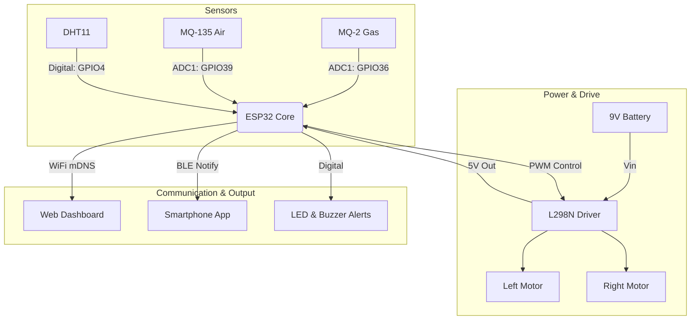

# HazardBot — Missing Poster Sections
## Team VERTEX · Ready to paste into poster

---

## 🔬 Methods

Developed via the **Engineering Design Process (EDP)**:

1. **Hardware Selection & Assembly:** An ESP32 was paired with an L298N motor driver and three sensors (MQ-2, MQ-135, DHT11) on an acrylic chassis. Voltage dividers (10kΩ/20kΩ) stepped sensor outputs from 5V to 3.3V to protect the ESP32.
2. **Firmware & Control:** C++ (Arduino) was used with non-blocking logic (`millis()`) to handle concurrent motor movement, sensor reading, and dual wireless stacks (BLE + WiFi).
3. **Interfaces:** Created a BLE MIT App Inventor app for joystick control and a local HTML/JS web dashboard for real-time monitoring (`ESPAsyncWebServer`).
4. **Calibration:** MQ sensors were calibrated in open air, and danger thresholds were established empirically (e.g., Safe <150 ADC, Danger >300 ADC).

---

## 📊 Analysis

### System Architecture & Data Flow
The integration of multiple subsystems on the ESP32 required careful resource management to avoid conflicts between WiFi operations and analog sensing.

**Hardware Conflict Resolutions:**
*   **ADC/WiFi Conflict:** A critical discovery was that the ESP32's ADC2 channel is disabled when WiFi is active. Rerouting the MQ-2 and MQ-135 to ADC1 pins (GPIO36, GPIO39) successfully resolved read failures.
*   **Boot Failures:** Initial use of GPIO12 for the motor enable pin (ENB) caused bootlooping due to its role as a strapping pin. Moving the PWM signal to GPIO13 stabilized the boot sequence.
*   **Power Delivery:** The 9V battery successfully drove the L298N motor controller, which reliably stepped down to 5V to power the ESP32. This avoided brownouts when WiFi and BLE were initialized concurrently, further stabilized by introducing a 2-second software delay between their respective startups.

**Sensor Calibration & Sensitivity:**
*   MQ sensors required a strict 2-minute preheating phase. Once stabilized, the safe baseline was measured at 60–90 ADC.
*   Exposure testing utilizing a butane lighter verified the rapid response of the MQ-2, spiking readings beyond 300 ADC within 2 seconds. Warning thresholds were adjusted dynamically based on environmental baselines (Warning: 150 ADC, Danger: 300 ADC).
*   The DHT11 maintained steady performance (±1°C, ±5% RH) utilizing non-blocking `millis()` sampling.

---

## ✅ Results

The project successfully delivered a fully functioning remote-controlled environmental monitoring rover within the target constraints.

### Performance Metrics
| Subsystem | Metric | Result |
| :--- | :--- | :--- |
| **Connectivity** | Bluetooth Control Range | 10+ meters (Stable) |
| | WiFi Dashboard Latency | ~200ms refresh rate |
| | Dual-Stack Radio | ✅ Maintained simultaneous WiFi & BLE |
| **Sensing** | MQ-2 Hazard Detection | ✅ Triggered within 2s of gas exposure |
| | MQ-135 Air Quality | ✅ Accurately responded to alcohol vapor |
| | DHT11 Climate | ✅ Consistent 26–30°C in lab conditions |
| **Action** | Visual/Audio Alerts | ✅ LED/Buzzer engaged precisely at thresholds |
| | Continuous Runtime | ~30 minutes under motor load |
| **Cost** | Total Budget | Operated within $24 USD |

### Key Achievements
1.  **Dual Interface:** The system provided seamless remote navigation via the Bluetooth joystick app while concurrently streaming live environmental data to the web dashboard.
2.  **Autonomous Alerting:** The hardware independently processed sensory data and triggered localized audio-visual alerts (buzzer and LED) the moment hazardous gas thresholds were breached.
3.  **Network Independence:** Leveraging mDNS, the rover was accessible on local networks without needing a static IP address, greatly enhancing user accessibility.

---

## 👥 Team Roles — What Each Member Did

---

### 1 — Abd-Elrahman Mohamed · System Architect
**What I did:** I designed the overall system — which components to use, how they connect, and which GPIO pins to assign. I built the final wiring, managed the voltage divider circuits, and led the integration of all subsystems into one working rover.
**Challenge I solved:** The ESP32's ADC2 pins stop working when WiFi is on. I identified this conflict and moved all sensor connections to ADC1 pins (GPIO36, 39), which fixed the issue completely.

---

### 2 — Fares Hassan · Motor & Movement Engineer
**What I did:** I wrote all the C++ code for motor control. Using the L298N motor driver, I programmed forward, backward, left turn, and right turn using 4 direction pins and 2 PWM pins for speed. I made sure the rover responds instantly to commands from the phone.
**Challenge I solved:** The rover kept going even after releasing a button because the code wasn't stopping motors when no command was received. I added a safety timeout — if no command arrives within 300ms, the rover stops automatically.

---

### 3 — Mohamed Adel · Gas Sensor Engineer
**What I did:** I connected and programmed the MQ-2 gas sensor, which detects LPG, propane, and smoke. I calibrated the sensor by observing its ADC readings in normal air versus near a gas source, and set the warning and danger thresholds accordingly.
**Challenge I solved:** The MQ-2 outputs 5V but the ESP32 can only handle 3.3V on its pins. I built a voltage divider using two resistors (10kΩ and 20kΩ) that reduces the voltage to exactly 3.3V before it reaches the ESP32.

---

### 4 — Malak Khalid · Air Quality & Climate Engineer
**What I did:** I connected and programmed both the MQ-135 air quality sensor and the DHT11 temperature/humidity sensor. I wrote the code to combine their readings — for example, if temperature is high AND gas is detected, that's a stronger danger signal than either alone.
**Challenge I solved:** DHT11 uses a timing-sensitive digital protocol that can fail if the code has delays. By using `millis()` instead of `delay()`, I kept the readings accurate without freezing the rest of the system.

---

### 5 — Ahmed Abobakr · Mobile App Developer
**What I did:** I built the smartphone control app using MIT App Inventor. The app connects to the rover via Bluetooth and shows a joystick-style control pad (Forward, Back, Left, Right) plus a live display of all sensor readings sent from the rover.
**Challenge I solved:** Holding down a direction button was sending commands too fast and crashing the connection. I used a Clock timer to send the command repeatedly every 100ms while held, and only stop when released — giving smooth, reliable control.

---

### 6 — Basmala Sherif · Communication Engineer
**What I did:** I wrote the Bluetooth communication layer on the ESP32 side. The ESP32 packages all sensor readings into a single string (Gas, Air, Temp, Humidity, Alert level) and sends it to the phone app every 2 seconds using BLE notifications. I also handled incoming drive commands from the app.
**Challenge I solved:** Running both BLE and WiFi at the same time caused memory issues. I adjusted the Arduino partition scheme to "Huge APP (3MB)" which gave both radio stacks enough memory to run without crashing.

---

### 7 — Ahmed Wael · Power & Hardware Integration Engineer
**What I did:** I managed the full power circuit — connecting the 9V battery to the L298N, which provides stable 5V to the ESP32. I physically mounted all components on the chassis, managed wire routing, and measured the actual battery runtime under motor load.
**Challenge I solved:** When WiFi and BLE both start at the same time, they draw a large current spike that triggers the ESP32's brownout detector and causes a crash loop. I added a 2-second delay between WiFi and BLE startup, which staggered the power draw and stopped the crashes.

---

### 8 — Mohra Hany · Alert & Threshold Logic Engineer
**What I did:** I coded the danger detection logic. Each sensor has three levels: Safe, Warning, and Danger. When a threshold is crossed, the ESP32 triggers the red LED on GPIO22 and the buzzer on GPIO23. The web dashboard also flashes red and sounds an alert.
**Challenge I solved:** The MQ sensor baselines changed as the hardware warmed up over sessions — what was "safe" at 1200 ADC on day one dropped to 60 ADC after calibration. I recalibrated all thresholds to match the actual sensor behavior: Warning at 150 ADC, Danger at 300 ADC.

---

### 9 — Malak Montaser · Web Dashboard Engineer
**What I did:** I built the web dashboard that runs in any browser on the local network. It shows live graphs for all four sensors, color-coded status badges (Safe / Warning / Danger), a rover control pad, and a real-time clock. The dashboard fetches new data from the ESP32 every 2 seconds automatically.
**Challenge I solved:** The ESP32's IP address changed every time it reconnected to the hotspot, so the dashboard link kept breaking. I integrated the mDNS library so the rover is always reachable at `http://hazardbot.local` — no IP needed.
