# 🛡️ HazardBot: Hazardous Environment Exploration Rover

> **Capstone Engineering Project · Team VERTEX (9 Members) · Minia University**  
> *Low-Cost Dual-Controlled (Bluetooth + WiFi) Environmental Reconnaissance Rover*

  
  
<em>HazardBot Rover — Two-Wheel Differential Drive with ESP32-WROOM-32 & MQ Gas Sensors</em>

---

## 📌 Executive Summary
**HazardBot** is an autonomous and teleoperated rover engineered to replace human entry into hazardous environments (chemical leaks, enclosed fires, industrial zones). Built for under **$25 USD**, it streams real-time telemetry—flammable gas concentrations, toxic air quality, temperature, and humidity—directly to a mobile Progressive Web App (PWA) and an onboard HTTP server hosted on a single **ESP32-WROOM-32** microcontroller.

---

## ✨ Key Capabilities
- **Dual Teleoperation Modes:**
  - **Bluetooth Mode:** Short-range, zero-latency direct manual joystick navigation via mobile app.
  - **WiFi AP Web Mode:** Local access point hosting an embedded web dashboard for real-time telemetry graphs and remote control.
- **Multi-Hazard Sensor Array:**
  - **MQ-2:** Flammable gases (LPG, Propane, Hydrogen, Smoke).
  - **MQ-135:** Toxic air pollutants (Benzene, Alcohol, Ammonia, CO2, Smoke).
  - **DHT11:** Ambient temperature (0–50°C) and relative humidity.
- **Safety Alert Subsystem:** Immediate audiovisual alarms (Active Buzzer + Red High-Luminance LED) triggered when gas thresholds breach safe limits.
- **Progressive Web App (PWA):** Installable offline web application with full joystick controls and live sensor gauges.

---

## 🔌 System Hardware Architecture (2-Tier Specification)

### Tier 1: The Big Picture (System Block Architecture)
*High-level interconnection of primary functional subsystems:*

```mermaid
graph LR
    PWR["🔋 7.4V Battery Pack<br>(2× 18650 Li-Ion)"] -->|"Raw 7.4V"| DRV["⚙️ L298N Motor Driver"]
    DRV -->|"Regulated 5V"| MCU["🧠 NodeMCU ESP32-S<br>(Core Controller)"]
    DRV -->|"High-Current PWM"| MOTORS["🚗 2× TT DC Motors<br>(Chassis Locomotion)"]
    
    SENSORS["📡 Environmental Array<br>(MQ-2, MQ-135, DHT11)"] -->|"Telemetry Signals"| MCU
    MCU -->|"Audible / Visual Alarms"| ALERTS["🚨 Buzzer & Alert LED"]
    
    MCU <===>|"BLE 4.2 / WiFi AP"| APP["📱 Smartphone PWA Dashboard"]

    style PWR fill:#2e1f0c,stroke:#f59e0b,stroke-width:2px
    style DRV fill:#2d1233,stroke:#c084fc,stroke-width:2px
    style MCU fill:#0a2540,stroke:#38bdf8,stroke-width:2px
    style MOTORS fill:#1e293b,stroke:#94a3b8,stroke-width:2px
    style SENSORS fill:#062e20,stroke:#34d399,stroke-width:2px
    style ALERTS fill:#38111a,stroke:#f43f5e,stroke-width:2px
    style APP fill:#1e1b4b,stroke:#818cf8,stroke-width:2px
```

---

### Tier 2: Pin-by-Pin Assembly Specification
*Bench wiring matrix with jumper color conventions and electrical protections:*

#### A. Propulsion & Motor Driver (L298N)
| Subsystem | Terminal / Pin | Wire Color | Connects To | MCU Pin / Bus | Electrical Notes |
| :--- | :--- | :---: | :--- | :--- | :--- |
| **Power In** | `12V Power` | 🔴 Red | Battery (+) | Battery Positive | 7.4V nominal direct battery input |
| **Ground** | `GND` | ⚫ Black | Battery (−) & MCU | **Common GND** | **Critical:** Star ground for motor noise isolation |
| **Logic Supply**| `5V Out` | 🟠 Orange | ESP32 Power In | **VIN** | Supplies regulated 5V to ESP32 regulator |
| **Left Speed** | `ENA` | ⚪ White | PWM Speed | **GPIO 14** | Left motor PWM duty cycle (0–255) |
| **Left Dir 1** | `IN1` | 🟡 Yellow | Direction Logic | **GPIO 27** | Forward / Backward H-Bridge logic |
| **Left Dir 2** | `IN2` | 🟢 Green | Direction Logic | **GPIO 26** | Forward / Backward H-Bridge logic |
| **Right Dir 1**| `IN3` | 🔵 Blue | Direction Logic | **GPIO 25** | Forward / Backward H-Bridge logic |
| **Right Dir 2**| `IN4` | 🟣 Purple | Direction Logic | **GPIO 33** | Forward / Backward H-Bridge logic |
| **Right Speed**| `ENB` | 🟤 Brown | PWM Speed | **GPIO 13** | *Moved from GPIO 12 to resolve boot strapping issue* |

#### B. Environmental Telemetry & Threat Alerts
| Sensor | Pin Label | Wire Color | Connects To | MCU Pin / Bus | Signal & Safety Protection |
| :--- | :--- | :---: | :--- | :--- | :--- |
| **MQ-2 Gas** | `VCC` | 🔴 Red | 5V Rail | **VIN / 5V** | 5V required for internal heating element |
| **MQ-2 Gas** | `GND` | ⚫ Black | Ground Rail | **GND** | Sensor circuit ground |
| **MQ-2 Gas** | `AO` | 🟡 Yellow | Voltage Divider In | — | Fed into 10kΩ series resistor |
| **Divider Mid**| `OUT` | 🟣 Purple | ADC Input | **GPIO 36 (ADC1_0)**| **Stepped to 3.3V** via 10k/20k resistor network |
| **MQ-135 Air** | `VCC` | 🔴 Red | 5V Rail | **VIN / 5V** | 5V required for internal heating element |
| **MQ-135 Air** | `GND` | ⚫ Black | Ground Rail | **GND** | Sensor circuit ground |
| **MQ-135 Air** | `AO` | 🟡 Yellow | Voltage Divider In | — | Fed into 10kΩ series resistor |
| **Divider Mid**| `OUT` | 🟣 Purple | ADC Input | **GPIO 39 (ADC1_3)**| **Stepped to 3.3V** via 10k/20k resistor network |
| **DHT11 Climate**| `VCC` / `GND`| 🔴 / ⚫ | 3.3V / GND Rail | **3V3 / GND** | Powered safely from 3.3V logic rail |
| **DHT11 Climate**| `DATA` | 🔵 Blue | Bidirectional Data | **GPIO 21** | Digital OneWire signal (integrated pull-up) |
| **Audio Alarm** | `+` (Anode)| 🟢 Green | Pulse Driver | **GPIO Alert** | Pulsed 500ms audio beep on threshold breach |

> [!WARNING] Crucial Electrical Invariants
> 1. **ADC1 Exclusivity:** All analog sensors are routed strictly to **ADC1 channels (GPIO 36 & 39)**. The ESP32 disables ADC2 completely whenever WiFi is broadcasting.
> 2. **5V Over-Voltage Guard:** Connecting MQ sensor 5V analog lines directly to an ESP32 without 10kΩ/20kΩ dividers will cause permanent silicon breakdown.
> 3. **Single Star Ground:** Motor ground and ESP32 logic ground must meet at one common point to prevent ground bounce.

---

## 📸 Physical Rover Gallery
| Top Chassis View | Electronics & Sensor Wiring |
| :---: | :---: |
|  |  |

---

## 📂 Repository Layout
- `firmware/`:
  - [`main.ino`](./firmware/main.ino): Production flight firmware v3.1 (BLE, WiFi AP web server, sensors, motor anti-spam).
  - [`sensor-calibration.ino`](./firmware/sensor-calibration.ino): Sensor baseline warmup and calibration test sketch.
- `app/`:
  - [`index.html`](./app/index.html): Progressive Web App UI with joystick and real-time dashboard.
  - [`manifest.json`](./app/manifest.json): PWA installation manifest.
  - Offline icons (`icon-192.png`, `icon-512.png`).
- `docs/`:
  - [`booklet.pdf`](./docs/booklet.pdf): Formal EDP Engineering Design Process Booklet.
  - [`booklet.md`](./docs/booklet.md): Comprehensive project technical answers & questions.
  - [`poster.md`](./docs/poster.md): Exhibition poster presentation content.
  - `media/`: Physical rover photos.
- [`project.json`](./project.json): Portfolio metadata feed.
