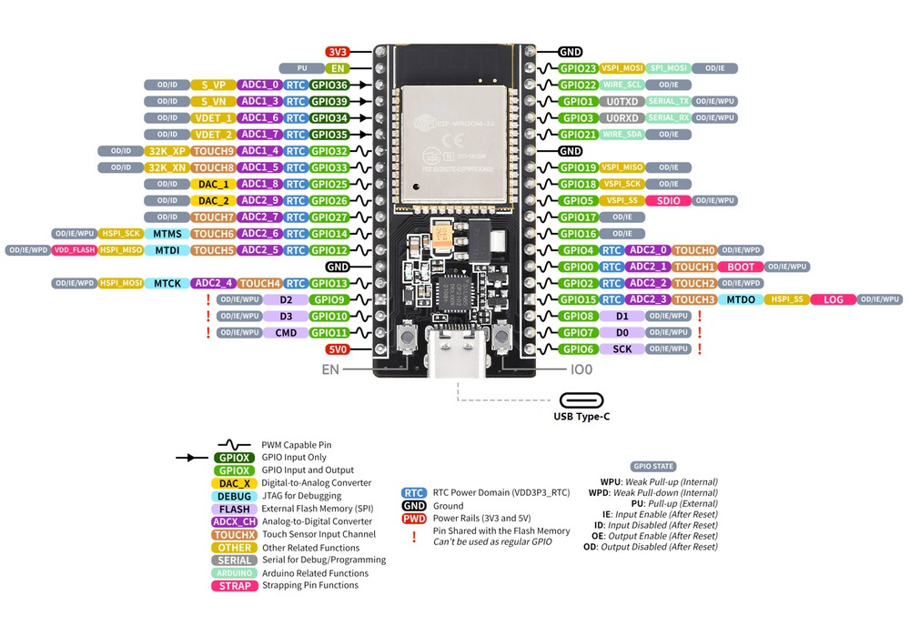
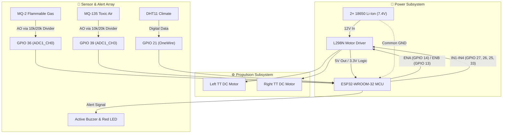
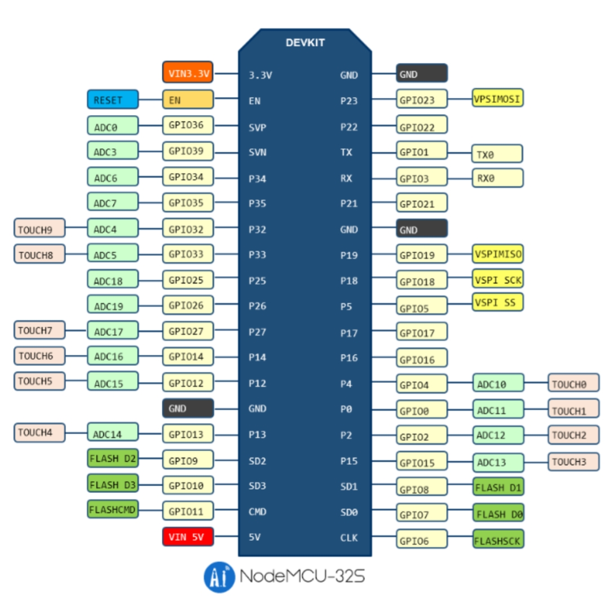
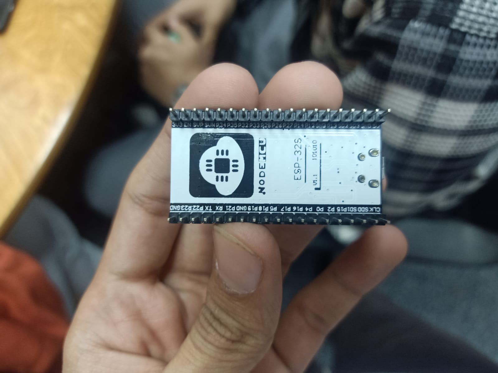

# 🛡️ HazardBot: Hazardous Environment Exploration Rover

> **Capstone Engineering Project · Team VERTEX (9 Members) · Minia University**  
> *Low-Cost Dual-Controlled (Bluetooth + WiFi) Environmental Reconnaissance Rover*

  
  
<em>HazardBot Rover — Two-Wheel Differential Drive with ESP32-WROOM-32 & MQ Gas Sensors</em>

---

## 📌 Executive Summary
**HazardBot** is an autonomous and teleoperated rover engineered to replace human entry into hazardous environments (chemical leaks, enclosed fires, industrial zones). Built for under **$25 USD**, it streams real-time telemetry—flammable gas concentrations, toxic air quality, temperature, and humidity—directly to a mobile Progressive Web App (PWA) and an onboard HTTP server hosted on a single **ESP32-WROOM-32** microcontroller.

---

## ✨ Key Capabilities
- **Dual Teleoperation Modes:**
  - **Bluetooth Mode:** Short-range, zero-latency direct manual joystick navigation via mobile app.
  - **WiFi AP Web Mode:** Local access point hosting an embedded web dashboard for real-time telemetry graphs and remote control.
- **Multi-Hazard Sensor Array:**
  - **MQ-2:** Flammable gases (LPG, Propane, Hydrogen, Smoke).
  - **MQ-135:** Toxic air pollutants (Benzene, Alcohol, Ammonia, CO2, Smoke).
  - **DHT11:** Ambient temperature (0–50°C) and relative humidity.
- **Safety Alert Subsystem:** Immediate audiovisual alarms (Active Buzzer + Red High-Luminance LED) triggered when gas thresholds breach safe limits.
- **Progressive Web App (PWA):** Installable offline web application with full joystick controls and live sensor gauges.

---

## 🔌 Visual Hardware Wiring & Signal Diagram

---

## 📋 Master Hardware Pinout Specification

### 1. Motor Driver (L298N) Interface
| Function | L298N Pin | ESP32 GPIO | Signal Type | Voltage / Notes |
| :--- | :--- | :--- | :--- | :--- |
| **Left Motor PWM Speed** | `ENA` | `GPIO 14` | Output (PWM) | Speed control (0–255) |
| **Left Motor Direction 1** | `IN1` | `GPIO 27` | Digital Output | High / Low logic |
| **Left Motor Direction 2** | `IN2` | `GPIO 26` | Digital Output | High / Low logic |
| **Right Motor Direction 1**| `IN3` | `GPIO 25` | Digital Output | High / Low logic |
| **Right Motor Direction 2**| `IN4` | `GPIO 33` | Digital Output | High / Low logic |
| **Right Motor PWM Speed** | `ENB` | `GPIO 13` | Output (PWM) | *Moved from GPIO 12 to prevent boot conflict* |

### 2. Environmental Sensors & Alerts Interface
| Component | Sensor Pin | ESP32 GPIO | Signal Type | Voltage & Critical Notes |
| :--- | :--- | :--- | :--- | :--- |
| **MQ-2 Gas Sensor** | `AO` (Analog) | `GPIO 36` (VP) | Analog (ADC1) | **10kΩ / 20kΩ Voltage Divider** (Scales 5V to 3.3V) |
| **MQ-135 Air Quality** | `AO` (Analog) | `GPIO 39` (VN) | Analog (ADC1) | **10kΩ / 20kΩ Voltage Divider** (Scales 5V to 3.3V) |
| **DHT11 Temp / Humidity**| `DATA` | `GPIO 21` | Digital Bidirectional | Powered via 3.3V rail |
| **Audio Alert** | `+` (Anode) | `GPIO alert` | Digital Output | Active high trigger (500ms pulsing) |

> [!WARNING] Hardware Protection Invariants
> 1. **ADC2 Contention:** All analog sensors are strictly wired to **ADC1 (GPIO 36 & 39)** because ESP32 WiFi transmission disables ADC2 entirely.
> 2. **Voltage Divider Safety:** Connecting MQ sensor 5V analog outputs directly to ESP32 without 10k/20k dividers will permanently burn GPIO inputs.
> 3. **Common Ground:** All battery, motor driver, and ESP32 grounds must connect to a single unified Ground bus.

---

## 📸 Physical Rover Gallery
| Top Chassis View | Electronics & Sensor Wiring |
| :---: | :---: |
|  |  |

---

## 📂 Repository Layout
- `firmware/`:
  - [`main.ino`](./firmware/main.ino): Production flight firmware v3.1 (BLE, WiFi AP web server, sensors, motor anti-spam).
  - [`sensor-calibration.ino`](./firmware/sensor-calibration.ino): Sensor baseline warmup and calibration test sketch.
- `app/`:
  - [`index.html`](./app/index.html): Progressive Web App UI with joystick and real-time dashboard.
  - [`manifest.json`](./app/manifest.json): PWA installation manifest.
  - Offline icons (`icon-192.png`, `icon-512.png`).
- `docs/`:
  - [`booklet.pdf`](./docs/booklet.pdf): Formal EDP Engineering Design Process Booklet.
  - [`booklet.md`](./docs/booklet.md): Comprehensive project technical answers & questions.
  - [`poster.md`](./docs/poster.md): Exhibition poster presentation content.
  - `media/`: Physical rover photos.
- [`project.json`](./project.json): Portfolio metadata feed.
