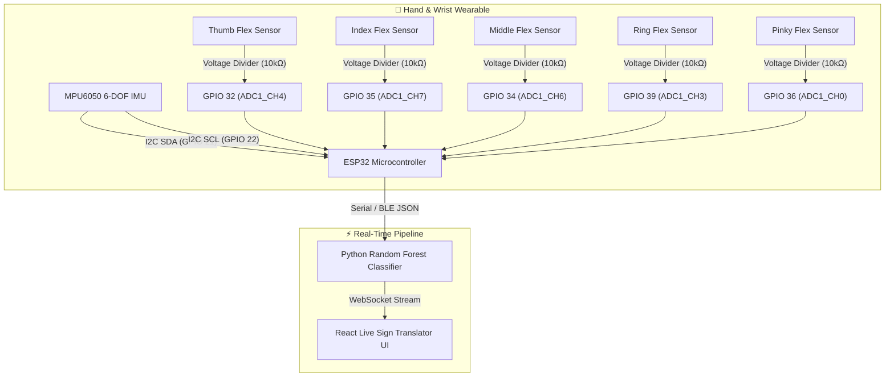

# 🧤 Smart Sign Language Glove

> **Real-Time Gesture Recognition & Sign Translation via ESP32, Flex Sensors, Random Forest ML & React**  
> *Assistive Wearable Technology Project · Minia University*

---

## 📌 Project Overview
The **Smart Sign Language Glove** is an assistive communication system engineered to bridge the communication divide between the Deaf/Hard-of-Hearing community and the non-signing public. 

It tracks hand gestures in real time using 5 finger flex sensors and a 6-axis inertial measurement unit (IMU), transmits kinematic telemetry to a Python machine learning engine for Random Forest classification, and broadcasts recognized letters/words to an interactive React dashboard via WebSockets.

---

## 🏛️ System Architecture
```
┌────────────────────────┐      Serial / BLE      ┌─────────────────────────┐     WebSockets     ┌────────────────────────┐
│  Hardware Glove        │ ─────────────────────> │  Python AI Backend      │ ─────────────────> │  React Web Dashboard   │
│  - ESP32 Microcontroller│                       │  - Data Collector       │                    │  - Real-time Visualizer│
│  - 5× Flex Sensors     │                        │  - Random Forest Model  │                    │  - Letter Translation  │
│  - MPU6050 6-DOF IMU   │                        │  - WebSocket Server     │                    │  - Historical Log      │
└────────────────────────┘                        └─────────────────────────┘                    └────────────────────────┘
```

---

## 🔌 Visual Hardware Wiring & Signal Diagram



---

## 📋 Master Hardware Pinout Specification

| Joint / Component | Sensor Hardware | ESP32 GPIO | Channel | Circuit Topology | Measurement Target |
| :--- | :--- | :--- | :--- | :--- | :--- |
| **Thumb** | 2.2" Flex Sensor | **GPIO 32** | ADC1_CH4 | 10kΩ Voltage Divider | Metacarpophalangeal flexion |
| **Index Finger** | 2.2" Flex Sensor | **GPIO 35** | ADC1_CH7 | 10kΩ Voltage Divider | Proximal interphalangeal flexion |
| **Middle Finger** | 2.2" Flex Sensor | **GPIO 34** | ADC1_CH6 | 10kΩ Voltage Divider | Proximal interphalangeal flexion |
| **Ring Finger** | 2.2" Flex Sensor | **GPIO 39** (VN) | ADC1_CH3 | 10kΩ Voltage Divider | Proximal interphalangeal flexion |
| **Pinky Finger** | 2.2" Flex Sensor | **GPIO 36** (VP) | ADC1_CH0 | 10kΩ Voltage Divider | Proximal interphalangeal flexion |
| **Wrist Gyroscope** | MPU6050 6-DOF | **GPIO 21** | I2C SDA | 4.7kΩ Pull-Up | Roll, pitch & yaw orientation |
| **Wrist Accelerometer** | MPU6050 6-DOF | **GPIO 22** | I2C SCL | 4.7kΩ Pull-Up | Dynamic gesture acceleration |

> [!NOTE] ADC1 Exclusivity
> - All 5 flex sensors are wired strictly to **ADC1 pins (GPIO 32, 34, 35, 36, 39)**. This allows uninterrupted BLE/WiFi wireless streaming from the ESP32 without ADC conflicts.

---

## 📂 Project Structure
- `firmware/`: ESP32 C++ firmware reading analog flex values and IMU quaternions.
- `backend/`: Python data collection, Random Forest model training, and WebSocket bridge.
- `frontend/`: React dashboard visualizing hand kinematic positions and live translations.
- [`project.json`](./project.json): Portfolio metadata feed.
