# 🧤 Smart Sign Language Glove

> **Real-Time Gesture Recognition & Sign Translation via ESP32, Flex Sensors, Random Forest ML & React**  
> *Assistive Wearable Technology Project · Minia University*

---

## 📌 Project Overview
The **Smart Sign Language Glove** is an assistive communication system engineered to bridge the communication divide between the Deaf/Hard-of-Hearing community and the non-signing public. 

It tracks hand gestures in real time using 5 finger flex sensors and a 6-axis inertial measurement unit (IMU), transmits kinematic telemetry to a Python machine learning engine for Random Forest classification, and broadcasts recognized letters/words to an interactive React dashboard via WebSockets.

---

## 🏛️ System Architecture
```
┌────────────────────────┐      Serial / BLE      ┌─────────────────────────┐     WebSockets     ┌────────────────────────┐
│  Hardware Glove        │ ─────────────────────> │  Python AI Backend      │ ─────────────────> │  React Web Dashboard   │
│  - ESP32 Microcontroller│                       │  - Data Collector       │                    │  - Real-time Visualizer│
│  - 5× Flex Sensors     │                        │  - Random Forest Model  │                    │  - Letter Translation  │
│  - MPU6050 6-DOF IMU   │                        │  - WebSocket Server     │                    │  - Historical Log      │
└────────────────────────┘                        └─────────────────────────┘                    └────────────────────────┘
```

---

## 🔌 System Hardware Architecture (2-Tier Specification)

### Tier 1: The Big Picture (System Block Architecture)
*High-level interconnection of primary functional subsystems:*

```mermaid
graph LR
    PWR["🔋 3.7V LiPo Battery<br>(Rechargeable Pack)"] -->|"Regulated 3.3V"| ESP["🧠 ESP32-WROOM-32<br>(Wearable Microcontroller)"]
    
    FLEX["🧤 5× Flex Sensor Array<br>(Finger Curvature Dividers)"] -->|"Analog Postures"| ESP
    IMU["🧭 MPU6050 6-DOF IMU<br>(Wrist Pitch / Roll / Yaw)"] -->|"I2C Fast Bus"| ESP
    
    ESP <===>|"BLE / USB Serial"| PY["🐍 Python AI Engine<br>(Random Forest Classifier)"]
    PY <===>|"Local WebSockets"| UI["💻 React Web Dashboard<br>(Live Word & Letter Display)"]

    style PWR fill:#2e1f0c,stroke:#f59e0b,stroke-width:2px
    style ESP fill:#0a2540,stroke:#38bdf8,stroke-width:2px
    style FLEX fill:#062e20,stroke:#34d399,stroke-width:2px
    style IMU fill:#134e4a,stroke:#2dd4bf,stroke-width:2px
    style PY fill:#2d1233,stroke:#c084fc,stroke-width:2px
    style UI fill:#1e1b4b,stroke:#818cf8,stroke-width:2px
```



---

### Tier 2: Pin-by-Pin Assembly Specification
*Bench wiring matrix with jumper color conventions:*

| Joint / Digit | Sensor Hardware | Wire Color | ESP32 GPIO | Channel | Circuit Topology | Biomechanical Measurement |
| :--- | :--- | :---: | :--- | :--- | :--- | :--- |
| **Thumb** | 2.2" Flex Sensor | 🟣 Purple | **GPIO 32** | ADC1_CH4 | 10kΩ Voltage Divider | Thumb opposition & bend angle |
| **Index Finger** | 2.2" Flex Sensor | 🔵 Blue | **GPIO 35** | ADC1_CH7 | 10kΩ Voltage Divider | Index finger pointing & hook flexion |
| **Middle Finger**| 2.2" Flex Sensor | 🟢 Green | **GPIO 34** | ADC1_CH6 | 10kΩ Voltage Divider | Middle finger joint curvature |
| **Ring Finger** | 2.2" Flex Sensor | 🟡 Yellow | **GPIO 39** (VN)| ADC1_CH3 | 10kΩ Voltage Divider | Ring finger contracture tracking |
| **Pinky Finger** | 2.2" Flex Sensor | ⚪ White | **GPIO 36** (VP)| ADC1_CH0 | 10kΩ Voltage Divider | Pinky extension for alphabet signs |
| **IMU Clock** | MPU6050 6-DOF | 🟠 Orange | **GPIO 22** | I2C SCL | 4.7kΩ Pull-Up | Angular velocity & orientation clock |
| **IMU Data** | MPU6050 6-DOF | 🟤 Brown | **GPIO 21** | I2C SDA | 4.7kΩ Pull-Up | 6-Axis motion telemetry |
| **Power Rails** | Common Bus | 🔴 / ⚫ | **3V3 / GND**| Power | Regulated 3.3V | Supplies clean reference to flex dividers |

> [!NOTE] ADC1 Hardware Isolation
> - All 5 flex sensor voltage dividers are wired strictly to **ADC1 channels (GPIO 32, 34, 35, 36, 39)**. This guarantees that wireless BLE telemetry transmissions will never cause ADC timeouts or corrupt analog reads.

---

## 📂 Project Structure
- `firmware/`: ESP32 C++ firmware reading analog flex values and IMU quaternions.
- `backend/`: Python data collection, Random Forest model training, and WebSocket bridge.
- `frontend/`: React dashboard visualizing hand kinematic positions and live translations.
- [`project.json`](./project.json): Portfolio metadata feed.
