# 🌱 Smart Greenhouse & Automated Plant System

> **IoT Microclimate & Soil Moisture Control with ESP8266 NodeMCU**  
> *Minia University, Faculty of Education — STEM Education & Technology*

---

## 📌 Project Overview
The **Smart Greenhouse System** is an automated IoT microclimate manager designed for precision agriculture and educational biology laboratories. Powered by an **ESP8266 NodeMCU**, the system continuously monitors environmental vital signs (temperature, humidity, soil hydration) and automatically actuates active climate controls without human intervention.

---

## ✨ Features
- **Closed-Loop Soil Hydration:** Resistive soil moisture sensor triggers a 5V submersible water pump when soil moisture falls below calibrated thresholds.
- **Microclimate Regulation:** DHT22 temperature and humidity sensor drives a 5V exhaust fan to vent excess heat.
- **Supplemental Photoperiod Lighting:** Relayed UV grow lighting cycle to maintain photosynthetic activity.
- **Real-Time Visual Feedback:** Adafruit SSD1306 (128×64) OLED I2C display provides real-time telemetry (Temp, Humidity, Soil %, Active Relay states).
- **Light-Sensitive Photoperiod:** Digital LDR Module measures ambient luminosity to trigger supplemental lighting.

---

## 🔌 System Hardware Architecture (2-Tier Specification)

### Tier 1: The Big Picture (System Block Architecture)
*High-level interconnection of primary functional subsystems:*

```mermaid
graph LR
    PWR["🔋 5V DC Power Supply<br>(USB / External Terminal)"] -->|"5V Main"| ESP["🧠 NodeMCU ESP8266<br>(Core Controller)"]
    PWR -->|"VCC Rail"| RELAYS["⚡ 4-Channel Relay Module<br>(Optoisolated Coils)"]
    
    SENSORS["📡 Environmental Sensors<br>(Soil Moisture, DHT22, LDR)"] -->|"Telemetry Signals"| ESP
    ESP -->|"I2C Bus"| OLED["🖥️ SSD1306 128×64 OLED<br>(Real-Time Dashboard)"]
    
    ESP -->|"Active-LOW Triggers"| RELAYS
    RELAYS --> PUMP["💧 Submersible Water Pump"]
    RELAYS --> FAN["💨 5V DC Exhaust Fan"]
    RELAYS --> LIGHT["💡 5V UV Grow Light"]

    style PWR fill:#2e1f0c,stroke:#f59e0b,stroke-width:2px
    style ESP fill:#0a2540,stroke:#38bdf8,stroke-width:2px
    style RELAYS fill:#2d1233,stroke:#c084fc,stroke-width:2px
    style SENSORS fill:#062e20,stroke:#34d399,stroke-width:2px
    style OLED fill:#134e4a,stroke:#2dd4bf,stroke-width:2px
    style PUMP fill:#1e293b,stroke:#94a3b8,stroke-width:2px
    style FAN fill:#1e293b,stroke:#94a3b8,stroke-width:2px
    style LIGHT fill:#3b0764,stroke:#d8b4fe,stroke-width:2px
```

---

### Tier 2: Pin-by-Pin Assembly Specification
*Bench wiring matrix with jumper color conventions:*

| Subsystem | Component | Component Pin | Wire Color | NodeMCU Pin | GPIO | Operating Logic & Thresholds |
| :--- | :--- | :--- | :---: | :--- | :--- | :--- |
| **Telemetry Display**| SSD1306 OLED | SCL | 🟡 Yellow | **D1** | GPIO 5 | I2C Clock · Diagnostic display |
| **Telemetry Display**| SSD1306 OLED | SDA | 🟢 Green | **D2** | GPIO 4 | I2C Data · 128×64 telemetry graphics |
| **Photoperiod Sensor**| LDR Light Module | DO | 🟣 Purple | **D3** | GPIO 0 | Digital Input · `HIGH` triggers UV lamp |
| **Microclimate** | DHT22 Climate | DATA | 🔵 Blue | **D4** | GPIO 2 | Digital OneWire · > 30°C Fan ON, < 25°C OFF |
| **Cooling Actuator** | 4-Ch Relay IN1 | IN1 | ⚪ White | **D5** | GPIO 14 | Active-LOW · Drives 5V exhaust fan |
| **Irrigation Pump** | 4-Ch Relay IN2 | IN2 | 🟠 Orange | **D6** | GPIO 12 | Active-LOW · Soil ADC > 650 triggers pump |
| **UV Grow Lamp** | 4-Ch Relay IN3 | IN3 | 🟤 Brown | **D7** | GPIO 13 | Active-LOW · Low ambient light triggers lamp |
| **Substrate Hydration**| Soil Moisture | AO | 🟡 Yellow | **A0** | ADC 0 | 0–1023 Analog (Dry > 650, Wet < 350) |
| **Power Distribution**| Power Bus | 5V / GND | 🔴 / ⚫ | **VIN / GND** | Power | Supplies 5V directly to relay coil bus |

> [!TIP] Power Distribution & Active-LOW Logic Notice
> - **Active-LOW Relays:** Setting the NodeMCU output pins to `LOW` closes the relay contacts and powers the peripheral.
> - **Regulator Protection:** Relays and pumps draw surge current; power them directly from the **VIN / 5V** power bus rather than pulling current through the ESP8266 onboard 3.3V LDO regulator.

---

## 📂 Source Code
- ESP8266 Firmware: [`firmware/main.ino`](./firmware/main.ino)
- Portfolio Feed: [`project.json`](./project.json)
