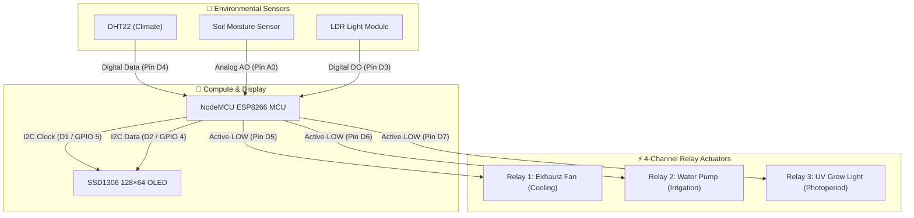

# 🌱 Smart Greenhouse & Automated Plant System

> **IoT Microclimate & Soil Moisture Control with ESP8266 NodeMCU**  
> *Minia University, Faculty of Education — STEM Education & Technology*

---

## 📌 Project Overview
The **Smart Greenhouse System** is an automated IoT microclimate manager designed for precision agriculture and educational biology laboratories. Powered by an **ESP8266 NodeMCU**, the system continuously monitors environmental vital signs (temperature, humidity, soil hydration) and automatically actuates active climate controls without human intervention.

---

## ✨ Features
- **Closed-Loop Soil Hydration:** Resistive soil moisture sensor triggers a 5V submersible water pump when soil moisture falls below calibrated thresholds.
- **Microclimate Regulation:** DHT22 temperature and humidity sensor drives a 5V exhaust fan to vent excess heat.
- **Supplemental Photoperiod Lighting:** Relayed UV grow lighting cycle to maintain photosynthetic activity.
- **Real-Time Visual Feedback:** Adafruit SSD1306 (128×64) OLED I2C display provides real-time telemetry (Temp, Humidity, Soil %, Active Relay states).
- **Light-Sensitive Photoperiod:** Digital LDR Module measures ambient luminosity to trigger supplemental lighting.

---

## 🔌 Visual Hardware Wiring & Signal Diagram

---

## 📋 Master Hardware Pinout Specification

| Subsystem | Component | Component Pin | NodeMCU Pin | GPIO | Signal Type | Operating Logic / Threshold |
| :--- | :--- | :--- | :--- | :--- | :--- | :--- |
| **Telemetry Display** | SSD1306 OLED | SCL | **D1** | GPIO 5 | I2C Clock | High-contrast visual dashboard |
| **Telemetry Display** | SSD1306 OLED | SDA | **D2** | GPIO 4 | I2C Data | 128×64 pixel display interface |
| **Light Sensing** | LDR Sensor | DO | **D3** | GPIO 0 | Digital Input | Dark (HIGH) triggers UV Grow Light |
| **Microclimate** | DHT22 Sensor | DATA | **D4** | GPIO 2 | OneWire Digital | > 30.0°C turns fan ON, < 25.0°C OFF |
| **Cooling Fan** | 4-Ch Relay IN1| IN1 | **D5** | GPIO 14 | Digital Output | Active-LOW (LOW = Relay closed) |
| **Irrigation Pump** | 4-Ch Relay IN2| IN2 | **D6** | GPIO 12 | Digital Output | Active-LOW (>650 ADC = Pump ON) |
| **UV Grow Lamp** | 4-Ch Relay IN3| IN3 | **D7** | GPIO 13 | Digital Output | Active-LOW (Low light = Light ON) |
| **Substrate Moisture**| Soil Moisture | AO | **A0** | ADC 0 | Analog Input | 0–1023 ADC (Dry > 650, Wet < 350) |

> [!TIP] Power Distribution & Active-LOW Notice
> - **Relay Control:** Relays operate on **Active-LOW** logic. Setting the GPIO to `LOW` energizes the relay coil.
> - **Powering the ESP8266:** Micro-USB provides 5V to the board, which passes through the `VIN` pin to power the 5V relay coils directly without pulling heavy current through the 3.3V internal regulator.

---

## 📂 Source Code
- ESP8266 Firmware: [`firmware/main.ino`](./firmware/main.ino)
- Portfolio Feed: [`project.json`](./project.json)
