# 🤖 Smart Nursing Robot

> **Autonomous Hospital Delivery Vehicle with Line Following & PID Control**  
> *Developed by Team VERTEX — Minia University, Faculty of Education (STEM Education & Engineering)*

---

## 📌 Project Overview
The **Smart Nursing Robot** is an autonomous guided vehicle designed to assist hospital staff by safely transporting pharmaceuticals and light medical supplies from central dispensaries directly to patient bedsides.

It utilizes an infrared reflectance sensor array paired with a **PID (Proportional-Derivative) controller** to achieve jitter-free trajectory tracking along pre-mapped hospital corridors.

---

## ✨ Key Features
- **Autonomous Path Traversal:** 5-channel QTR-8A IR sensor array calculates line position with high-frequency feedback loops.
- **PID Control Loop:** Proportional-Derivative regulation guarantees smooth cornering without overshooting or oscillation.
- **Secure Medicine Delivery Bay:** Servo-actuated medicine compartment with capacitive touch activation (`TTP223`).
- **Patient Arrival Alert System:** Automatic audio buzzer triggers upon reaching the target stop marker, auto-silencing when the patient touches the sensor and retrieves their medicine.
- **Fail-Safe Arrival Detection:** Confirms destination arrival across all sensors before entering hold state.

---

## 🔌 System Hardware Architecture (2-Tier Specification)

### Tier 1: The Big Picture (System Block Architecture)
*High-level interconnection of primary functional subsystems:*

```mermaid
graph LR
    BAT["🔋 7.4V Battery Pack<br>(2× 18650 Li-Ion)"] -->|"Motor Power"| SHIELD["⚙️ Adafruit Motor Shield v1"]
    SHIELD -->|"Regulated 5V"| UNO["🧠 Arduino Uno (ATmega328P)<br>(Core Controller)"]
    
    SHIELD -->|"Dual DC Drive"| MOTORS["🚗 2× DC Gear Motors<br>(Differential Locomotion)"]
    SHIELD -->|"Pulse Alarm"| BUZZ["🚨 Arrival Alert Buzzer"]
    
    QTR["📡 5-Channel QTR-8A Sensor<br>(Ground Reflectance Line Array)"] -->|"Position Signals"| UNO
    TOUCH["👆 TTP223 Touch Sensor<br>(Medicine Bay Trigger)"] -->|"Toggle Event"| UNO
    UNO -->|"Lid Open/Close"| SERVO["📦 SG90 Micro Servo<br>(Medicine Lid)"]

    style BAT fill:#2e1f0c,stroke:#f59e0b,stroke-width:2px
    style SHIELD fill:#2d1233,stroke:#c084fc,stroke-width:2px
    style UNO fill:#0a2540,stroke:#38bdf8,stroke-width:2px
    style MOTORS fill:#1e293b,stroke:#94a3b8,stroke-width:2px
    style QTR fill:#062e20,stroke:#34d399,stroke-width:2px
    style TOUCH fill:#134e4a,stroke:#2dd4bf,stroke-width:2px
    style BUZZ fill:#38111a,stroke:#f43f5e,stroke-width:2px
    style SERVO fill:#3b0764,stroke:#d8b4fe,stroke-width:2px
```

---

### Tier 2: Pin-by-Pin Assembly Specification
*Bench wiring matrix with jumper color conventions:*

| Subsystem | Component | Component Pin | Wire Color | Connects To | Signal / Protocol | Notes & Operating Logic |
| :--- | :--- | :--- | :---: | :--- | :--- | :--- |
| **Locomotion** | Left Drive Motor | Terminals | 🔴 / ⚫ | **Shield Port M1** | 1 kHz PWM | Speed modulated by PID loop |
| **Locomotion** | Right Drive Motor| Terminals | 🔴 / ⚫ | **Shield Port M2** | 1 kHz PWM | Speed modulated by PID loop |
| **Alarm** | Arrival Buzzer | Terminals | 🔴 / ⚫ | **Shield Port M3** | 1 kHz DC Pulse| 500ms pulsed audible arrival chime |
| **Medicine Bay**| SG90 Servo | Signal | 🟠 Orange | **Pin 10 (SERVO)**| 50 Hz PWM | 90° Closed $\leftrightarrow$ 180° Open |
| **Medicine Bay**| SG90 Servo | VCC / GND | 🔴 / ⚫ | **5V / GND** | 5V DC Rail | Powered from Shield 5V rail |
| **Touch Trigger**| TTP223 Sensor | I/O OUT | 🟢 Green | **Pin A5** | Digital Input | Contact-free capacitive bay toggle |
| **Line Tracker** | QTR Sensor 1 | OUT 1 | 🟣 Purple | **Pin A0** | Analog / RC Read | Far-right line marker detector |
| **Line Tracker** | QTR Sensor 2 | OUT 2 | 🔵 Blue | **Pin A1** | Analog / RC Read | Inner-right guidance sensor |
| **Line Tracker** | QTR Sensor 3 | OUT 3 | 🟡 Yellow | **Pin A2** | Analog / RC Read | Centerline tracking sensor |
| **Line Tracker** | QTR Sensor 4 | OUT 4 | 🟢 Green | **Pin A3** | Analog / RC Read | Inner-left guidance sensor |
| **Line Tracker** | QTR Sensor 5 | OUT 5 | ⚪ White | **Pin A4** | Analog / RC Read | Far-left line marker detector |
| **Emitter Bus** | QTR Array | LEDON | 🟤 Brown | **Pin 2** | Digital Output | Shuts off IR emitters for calibration |

> [!NOTE] Power Supply & Inductive Isolation
> - The Adafruit Motor Shield is powered directly via an external 7.4V battery pack with the `PWR` jumper in place. This isolates inductive motor current spikes from the sensitive ATmega328P logic lines, preventing system freezes and jitter.

---

## 📂 Project Structure & Documentation
- **Firmware**: [`firmware/main.ino`](./firmware/main.ino) (PID Line Tracker + Capacitive Touch Dispenser)
- **Educational Guides**:
  - [`docs/student-guide-ar.html`](./docs/student-guide-ar.html): دليل مبسط ومصاحب للطلاب لشرح عمل الروبوت ومكوناته
  - [`docs/rebuild-handout.html`](./docs/rebuild-handout.html): Full engineering rebuild & assembly guide
- **Metadata**: [`project.json`](./project.json)

