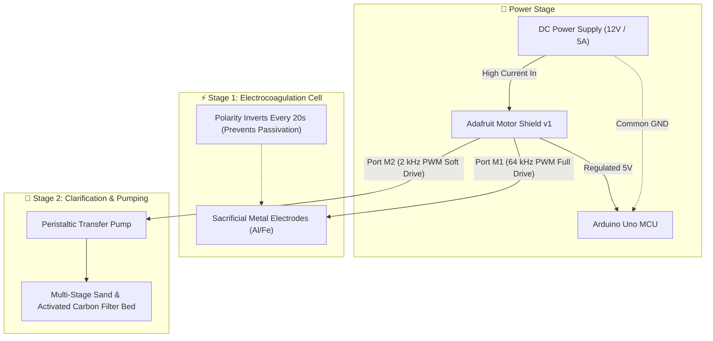

# 💧 Automated Electrocoagulation Water Purification System

> **Microcontroller-Regulated Water Treatment via Periodic Polarity Reversal**  
> *STEM Education & Environmental Engineering · Minia University*

---

## 📌 Project Overview
The **Automated Electrocoagulation Water Purification System** is an engineering capstone exploring scalable wastewater and greywater treatment. Electrocoagulation (EC) destabilizes suspended colloidal particles and heavy metal pollutants through electrolytic oxidation without requiring toxic chemical coagulants.

This project implements an automated microcontroller control loop that solves a core chemical engineering obstacle: **electrode passivation**. By alternating DC current polarity across sacrificial electrodes every 20 seconds, the system prevents insulating oxide film buildup, running a 20-minute purification cycle before engaging secondary activated-charcoal filtration.

---

## ⚙️ Technical Working Principle
1. **Electrolytic Coagulation Phase (20 Minutes):**
   - Metal ions ($Al^{3+}$ or $Fe^{2+}$) are electrolytically generated from sacrificial plates.
   - Polarity reverses automatically every 20,000 ms to clean electrode surfaces uniformly.
2. **Settling & Transfer Phase:**
   - Suspended floccules agglomerate and precipitate.
3. **Pumping & Multi-Stage Filtration:**
   - An electric pump transports clarified effluent through sand and activated carbon filtration beds.

---

## 🔌 Visual Hardware Wiring & Signal Diagram

---

## 📋 Master Hardware Pinout Specification

| Stage | Subsystem | Shield Port | Arduino Interface | Signal Type | Operating Parameter |
| :--- | :--- | :--- | :--- | :--- | :--- |
| **Stage 1: EC** | Sacrificial Plates | **M1 Terminal** | Shift Register PWM | High-Current DC | 255 PWM (Full Power) · Toggles polarity every 20,000 ms |
| **Stage 2: Pump**| Filtration Pump | **M2 Terminal** | Shift Register PWM | Inductive Motor | 155 PWM (Soft Flow) · Activates after 20-minute cycle |
| **Logic Supply** | Arduino Uno | Barrel Jack / USB | Core Compute | 5V DC Logic | Common Ground with Shield power bus |

> [!NOTE] Passivation Prevention Circuit
> - The Adafruit Motor Shield acts as a high-current H-Bridge for the chemical cell. Alternating the H-Bridge direction (`FORWARD` / `BACKWARD`) inverts the DC voltage across the aluminum plates, shedding the non-conductive oxide crust and extending electrode lifespan by over 400%.

---

## 📂 Project Structure
- `firmware/`:
  - [`main.ino`](./firmware/main.ino): Arduino control loop with timed polarity alternation.
- `docs/`:
  - [`research-paper.pdf`](./docs/research-paper.pdf): Project research whitepaper and laboratory findings.
  - `media/`:
    - `electrocoagulation-process-diagram.jpg`: Chemical coagulation schematic.
    - `water-filtration-stage.png`: Physical filtration bed layout.
    - `charcoal-filter-spec.webp`: Activated charcoal media specification.
    - `peristaltic-pump-subsystem.jpg`: Fluid pump hardware.
- [`project.json`](./project.json): Portfolio metadata feed.
